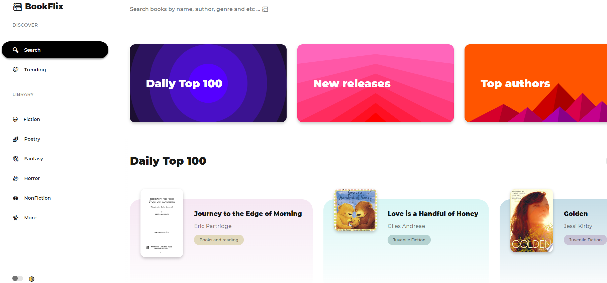

# Bookflix

 <h1>Bookflix - A place to manage, explore and review books all from your browser.</h1>

	

## 🏁 Introduction

Bookflix is a website where you can enjoy, and explore the world of books - with your friends, and in the comfort of your browser!

Bookflix is a social platform, as well as a site dedicated to books, in accordance with our tagline - Bookflix offers you the following delights :-

1. Searching for books by title, subject, and isbn, and viewing information associated with them, such as a short description, similar books, published versions.
2. Bookflix allows you to publish reviews about books, and rate them, which is then stored in our own databases.
3. On Bookflix, you can follow other users to see what books they read, and be notified whenever they publish a review.

Please note that we use the Google Books API to obtain some information about books and to allow users to read them, so these features alone may not be available for all books. 

## 💻 Usage

To get started, head over to our website - [Bookflix](https://harry-hopkinson.github.io/BookFlix/). You will instantly be met with the homepage, where you can search for books by title, subject, or explore by genre or daily rated books.

To explore our collection of books, ratings, reviews, and users, head over to the [Explore page](https://harry-hopkinson.github.io/BookFlix/#search), and search for a book, or user you want to view! When searching for books, you can search by name, by subject, and by its ISBN - International Standard Book Number.

To explore trending books head over to the Trending Books which shows trending books with the New York Times API [Trending page](https://harry-hopkinson.github.io/BookFlix/#foryou)

Once you provide your search query, Bookflix will fetch data from the Google Books API, and our own databases for a wide collection of books, and users. You can browse these, at your leisure!

<h3 allign="center">Bookflix - Explore the world of books, with your friends! </h3>
